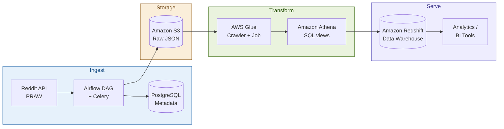

<div align="center">

# Reddit Data Pipeline

[](https://python.org)
[](https://airflow.apache.org)
[](https://docker.com)
[](https://aws.amazon.com)
[](LICENSE)

A production-grade ETL pipeline that extracts posts from the Reddit API, stages them in S3, transforms them with AWS Glue + Athena, and loads the results into a Redshift data warehouse — all orchestrated by Apache Airflow running in Docker.

</div>

---

## Architecture



| Stage | Tool | Role |
|---|---|---|
| Orchestration | Apache Airflow + Celery | DAG scheduling, task distribution, retries |
| Metadata store | PostgreSQL | Airflow backend, pipeline run history |
| Extraction | PRAW (Reddit API) | Pull posts, comments, metadata |
| Raw storage | Amazon S3 | Immutable data lake landing zone |
| Cataloguing | AWS Glue Crawler | Auto-detect schema, populate Data Catalog |
| Transformation | AWS Glue Jobs + Amazon Athena | Clean, deduplicate, aggregate via SQL |
| Warehousing | Amazon Redshift | Columnar analytics at scale |

---

## Project Structure

```
├── dags/               # Airflow DAG definitions
├── etls/               # Extraction & transformation logic
├── pipelines/          # Pipeline orchestration helpers
├── utils/              # Shared utilities (config, logging)
├── data/               # Local staging for development
├── Dockerfile          # Custom Airflow image
├── docker-compose.yml  # Full stack: Airflow, Celery, PostgreSQL
├── airflow.env         # Environment variables template
└── requirements.txt    # Python dependencies
```

---

## Prerequisites

| Requirement | Version |
|---|---|
| Python | 3.9+ |
| Docker + Docker Compose | Latest |
| AWS Account | S3, Glue, Athena, Redshift permissions |
| Reddit API credentials | [Create app here](https://www.reddit.com/prefs/apps) |

---

## Quick Start

```bash
# 1. Clone
git clone https://github.com/Sellesta/Reddit-Data-Pipeline-with-Airflow-Celery-PostgreSQL-S3-AWS-Glue-Athena-and-Redshift.git
cd Reddit-Data-Pipeline-with-Airflow-Celery-PostgreSQL-S3-AWS-Glue-Athena-and-Redshift

# 2. Configure
cp airflow.env .env
# Edit .env — add your Reddit API keys and AWS credentials

# 3. Launch the stack
docker-compose up -d

# 4. Open Airflow UI
open http://localhost:8080
# Default login: airflow / airflow

# 5. Enable the DAG and trigger a run
```

---

## AWS Setup

Before running the pipeline, provision the following:

```
S3:       Create a bucket (e.g. reddit-raw-data-<your-name>)
Glue:     Create a Crawler pointing at the S3 bucket prefix
Athena:   Set a query results location in the same bucket
Redshift: Create a cluster and a target schema/table
IAM:      Attach AmazonS3FullAccess, AWSGlueConsoleFullAccess,
          AmazonAthenaFullAccess, AmazonRedshiftFullAccess to your user/role
```

Update the paths in `utils/config.py` to match your bucket name and Redshift connection string.

---

## How It Works

1. Airflow triggers the DAG on a schedule (configurable — default daily)
2. A Celery worker calls the Reddit API via PRAW and pulls the top N posts from a target subreddit
3. Raw JSON is written to S3 at `s3://<bucket>/raw/YYYY/MM/DD/`
4. AWS Glue Crawler runs and updates the Data Catalog schema
5. A Glue Job + Athena view cleans and aggregates the data
6. The transformed dataset is `COPY`-loaded into Redshift
7. Airflow marks the DAG run complete and logs metadata to PostgreSQL

---

## Configuration

Key settings in `utils/config.py`:

| Variable | Description |
|---|---|
| `REDDIT_CLIENT_ID` | Reddit API app client ID |
| `REDDIT_SECRET` | Reddit API app secret |
| `TARGET_SUBREDDIT` | Subreddit to pull from (default: `r/dataengineering`) |
| `POST_LIMIT` | Number of posts per run |
| `S3_BUCKET` | Your S3 bucket name |
| `REDSHIFT_CONN` | SQLAlchemy connection string |

---

## Author

Built by [Moses Wanjema](https://github.com/Sellesta) · [LinkedIn](https://www.linkedin.com/in/moses-wanjema-a43253133/) · [Portfolio](https://datascienceportfol.io/brilliantpenman)
